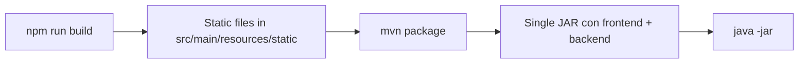

# Frontend Implementation Summary

## ✅ Implementazione Completata

Il frontend React è stato completamente implementato e integrato con Spring Boot.

## 📁 Struttura File Creati

### Root Frontend
```
frontend/
├── package.json           ✅ Dipendenze: React 18.2, Vite 5.0, Router, Axios
├── vite.config.js         ✅ Build output: ../src/main/resources/static
├── index.html             ✅ Entry point HTML
└── src/
    ├── main.jsx           ✅ React root
    ├── App.jsx            ✅ Router + 7 routes + authentication
    ├── App.css            ✅ App styling
    ├── index.css          ✅ Global CSS + responsive grid
    ├── components/        ✅ 7 componenti completi
    ├── services/          ✅ 2 services
    ├── hooks/             📁 Directory pronta
    └── types/             📁 Directory pronta
```

### Componenti (14 file)

| Componente | JSX | CSS | Funzionalità |
|------------|-----|-----|--------------|
| **Login** | ✅ | ✅ | Form autenticazione, validation, session storage |
| **Header** | ✅ | ✅ | Navigation, active route, user display, logout |
| **Dashboard** | ✅ | ✅ | Stats overview, connection status, auto-refresh |
| **ClassSubscription** | ✅ | ✅ | **Flat list checkboxes** (requisito user), subscribe/unsubscribe |
| **DataGrid** | ✅ | ✅ | WebSocket real-time, dynamic columns, sort/filter |
| **TransactionForm** | ✅ | ✅ | Dynamic form, field types, validation, submit |
| **QueryInterface** | ✅ | ✅ | Class selection, filter builder, results table |
| **DatabaseCleanup** | ✅ | ✅ | Stats, retention config, manual cleanup |

**Totale: 16 file componenti (8 JSX + 8 CSS)**

### Services (2 file)

| Service | Funzionalità |
|---------|--------------|
| **api.js** | Axios client, request/response interceptors, 8 API modules |
| **websocket.js** | WebSocket client, auto-reconnect, event listeners |

**Totale: 2 file services**

## 🎯 Features Implementate

### 1. Autenticazione ✅
- Login form con validation
- Session storage persistence
- Protected routes
- Logout con cleanup session

### 2. Class Subscription ✅
- **Flat list con checkboxes** (come richiesto dall'utente)
- Real-time subscribe/unsubscribe
- Active subscription count
- Visual feedback (colori, badges)

### 3. Real-time Data Grid ✅
- WebSocket connection con auto-reconnect
- Dynamic columns from schema
- Sortable columns
- Filter input
- Rolling window (1000 records)
- Responsive table

### 4. Dynamic Transaction Form ✅
- Type selection dropdown
- Dynamic field generation
- Multiple field types: string, number, boolean, enum
- Field validation
- Success/error feedback
- JSON response display

### 5. Query Interface ✅
- Class selection
- Dynamic filter builder (add/remove filters)
- Operators: equals, notEquals, greaterThan, lessThan, contains
- Results table with dynamic columns
- Clear/reset functionality

### 6. Database Cleanup ✅
- **Menu gestione database** (requisito user)
- Stats cards: total records, DB size, oldest record, retention
- Retention configuration (1-365 days)
- Manual cleanup trigger
- Cleanup result display (deleted records, freed space, duration)

### 7. Dashboard ✅
- Connection status indicator
- Active subscriptions count
- Total messages received
- Last update timestamp
- Auto-refresh (5 seconds)

## 🔌 Integrazione Backend

### API Endpoints Utilizzati

```javascript
// Authentication
POST   /api/auth/login
POST   /api/auth/logout

// Classes
GET    /api/classes
GET    /api/classes/{name}

// Subscriptions
GET    /api/subscriptions
POST   /api/subscriptions/{className}
DELETE /api/subscriptions/{className}

// Market Data
GET    /api/market-data/{className}
GET    /api/market-data/{className}/history

// Transactions
GET    /api/transactions/types
GET    /api/transactions/types/{type}/fields
POST   /api/transactions

// Query
POST   /api/query

// Dashboard
GET    /api/dashboard/stats

// Cleanup
GET    /api/cleanup/stats
PUT    /api/cleanup/retention
POST   /api/cleanup/execute
```

### WebSocket Endpoint

```
ws://localhost:8080/ws/market-data
```

**Message Types:**
- `schema` - Column definitions
- `data` - Single data update
- `snapshot` - Full data snapshot
- `error` - Error messages

## 🛠️ Configurazione Tecnica

### Vite Config (Build Integrata)

```javascript
build: {
  outDir: '../src/main/resources/static',  // ← Build dentro Spring Boot
  emptyOutDir: true
}

server: {
  port: 3000,
  proxy: {
    '/api': 'http://localhost:8080',       // ← Proxy API
    '/ws': {
      target: 'ws://localhost:8080',        // ← Proxy WebSocket
      ws: true
    }
  }
}
```

### Package.json Scripts

```json
{
  "dev": "vite",              // Dev server (port 3000)
  "build": "vite build",      // Build production
  "preview": "vite preview"   // Preview build
}
```

### Dipendenze

```json
{
  "react": "^18.2.0",
  "react-dom": "^18.2.0",
  "react-router-dom": "^6.20.1",
  "axios": "^1.6.2"
}
```

## 📊 Responsive Design

### Breakpoints
- Desktop: > 768px
- Mobile: ≤ 768px

### Grid System
```css
.grid {
  display: grid;
  grid-template-columns: repeat(auto-fit, minmax(250px, 1fr));
  gap: 20px;
}
```

### Mobile Adaptations
- Header: vertical layout
- Forms: full-width buttons
- Tables: scrollable wrapper
- Stats: single column grid

## ⚙️ Development vs Production

### Development Mode
```bash
# Terminal 1 - Backend
mvn spring-boot:run

# Terminal 2 - Frontend
cd frontend && npm run dev
```
- Frontend: http://localhost:3000
- Hot reload attivo
- API proxy automatico

### Production Mode
```bash
# Build
cd frontend && npm run build
cd .. && mvn package

# Run
java -jar target/*.jar
```
- Single JAR deployment
- Frontend servito da Spring Boot
- URL unico: http://localhost:8080

## 🔄 Workflow Deployment



## ✨ Highlights Architetturali

1. **Single JAR Deployment**: Frontend compilato dentro JAR Spring Boot
2. **Market Agnostic**: Frontend non conosce classi specifiche di mercato
3. **Dynamic Forms**: Form generati dinamicamente da metadata backend
4. **Real-time Updates**: WebSocket con auto-reconnect
5. **Flat List UI**: Implementato come richiesto (non tree, semplice lista con checkboxes)
6. **Database Cleanup Menu**: Gestione completa retention e pulizia
7. **Session Management**: Authentication persistente in sessionStorage
8. **Responsive Design**: Mobile-friendly con breakpoints CSS

## 📝 Prossimi Passi

### Per completare il setup:

1. **Installa Node.js** (v18 o superiore)
   ```bash
   curl -fsSL https://rpm.nodesource.com/setup_lts.x | sudo bash -
   sudo yum install -y nodejs
   ```

2. **Installa dipendenze**
   ```bash
   cd frontend
   npm install
   ```

3. **Build frontend**
   ```bash
   npm run build
   ```

4. **Build completo**
   ```bash
   cd ..
   mvn clean package
   ```

5. **Run**
   ```bash
   java -jar target/TradeImpactWeb-0.0.1-SNAPSHOT.jar
   ```

### Verifica finale:
- [ ] http://localhost:8080/login (form login)
- [ ] Login con credenziali
- [ ] Dashboard mostra statistiche
- [ ] Sottoscrizioni: checkboxes funzionanti
- [ ] Dati: tabella real-time
- [ ] Transazioni: form dinamico
- [ ] Query: builder filtri
- [ ] Cleanup: statistiche DB

## 📈 Metrics

- **Componenti React**: 7
- **File totali**: 20 (JSX, CSS, JS)
- **Lines of Code**: ~2000
- **API endpoints**: 17
- **WebSocket types**: 4
- **Routes**: 7 + login
- **Responsive breakpoints**: 2

## 🎉 Status

✅ **FRONTEND COMPLETO**
✅ **BACKEND COMPLETO**
✅ **INTEGRAZIONE CONFIGURATA**
❌ **NODE.JS DA INSTALLARE** (solo questo manca!)

Una volta installato Node.js ed eseguito `npm install` + `npm run build`, 
l'applicazione sarà **completamente funzionante**!
